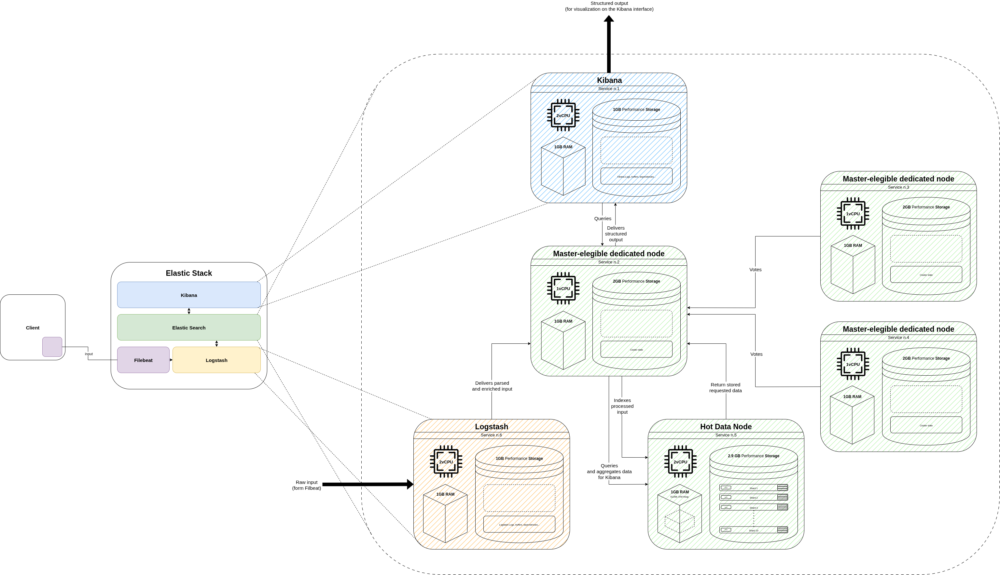

# Elastic Stack for rootless_V2CI Log Ingestion
A plug & play system for the ingestion, processing, storage, and user-friendly visualization of Rootless_V2CI logs.

## Introduction
The objective of this lightweight Elastic Stack is strictly tied to the use of the cross-compilation engine for Virtualsquare projects, Rootless_V2CI.  
This engine, as described in its official repository https://github.com/BBFrank/rootless_V2CI, was designed to simplify the development and integration of unofficial Virtualsquare projects—therefore not available via conventional package managers—on Debian-based systems.  
This system produces, for each cross-compilation, for every project and for every architecture, a considerable amount of logs.  
In order to allow the user to monitor in real time the progress and outcomes of the process started by Rootless_V2CI, this lightweight Elastic Stack ingests, processes, stores, and enables a user-friendly visualization of the cross-compilation engine logs through the following components:
- **Filebeat**: a very lightweight agent that, once installed on the host(s) (single or multiple) where Rootless_V2CI is running, will send the logs to the stack without any heavy preprocessing;
- **Logstash**: a powerful data processing pipeline that receives logs from Filebeat, enriches them, and transforms them into a structured format before forwarding them to Elasticsearch for indexing;
- **Elasticsearch**: a distributed search and analytics engine that stores the processed logs and enables fast and complex queries on the data;
- **Kibana**: a visualization platform that allows creation of interactive dashboards and reports based on the logs stored in Elasticsearch.

## Quick Start
> Note: For correct operation, it is recommended to start this Elastic Stack only after at least one initial cross-compilation cycle of Rootless_V2CI has completed for at least one of the projects listed in its `config.yaml` file (Filebeat requires the main Rootless_V2CI log output directories to already exist in order to begin ingestion).

### Prerequisites

#### Privileges
Unfortunately—unlike Rootless_V2CI itself—running this Elastic Stack requires administrator (root) privileges on the host (or hosts) where it will be deployed.

#### Recommended minimum resources
In enterprise production environments Elastic typically requires significant hardware resources, to the point that deploying all components of the stack on a single host is usually discouraged.  
However, in this specific use case—since the log volume produced by Rootless_V2CI is relatively limited (with respect to average Elastic workloads)—it was possible to minimize resource consumption by relying on a container-based deployment orchestrated via docker-compose.  
These containers are configured to let the user decide whether to run the stack on a single host (Filebeat ingesting Rootless_V2CI logs on the same system as the rest of the stack) or to run Filebeat agents on one or more remote hosts (where Rootless_V2CI instances are running) and the rest of the stack on a dedicated host.  
In particular, for correct operation in both scenarios, it is recommended that the host(s) running the stack provide:
- 8 CPU cores at 2.5 GHz or higher
- 16 GB RAM
- 30 GB of free disk space

### Environment variable configuration
Before starting the stack, it is necessary to configure some environment variables that allow customization of component behavior (e.g. service communication ports, Kibana access credentials, the build directory path on the monitored host, etc.).  
These variables are defined in the two `.env` files located in the `elastic-log-monitoring` and `filebeat-log-monitoring` directories.

### Startup
Execute the following steps in order (regardless of whether you choose a single-host or multi-host deployment):

#### Start the Elastic Stack (Elasticsearch + Logstash + Kibana)
```bash
cd elastic-log-monitoring
sudo chmod +x ./*.sh ./scrpts/*.sh
sudo ./install.sh
sudo systemctl enable elastic-stack
sudo systemctl status elastic-stack
```

#### Start the Filebeat agents
```bash
cd filebeat-log-monitoring
sudo chmod +x ./*.sh
sudo ./install.sh
sudo systemctl enable v2ci-filebeat
sudo systemctl status v2ci-filebeat
```

### Accessing Kibana
Once the stack is running, you can access the Kibana web interface via a browser on the system where it is running at: `https://v2ci-kibana:5601`.

> Note: By default, the browser may display an insecure connection warning due to the self-signed SSL certificate used by the stack. You can proceed by ignoring the warning.  
Additionally, if the `https` connection is inaccessible, add an exception in the browser’s security settings for the self-signed SSL certificate located at `elastic-log-monitoring/certs/ca/ca.crt`.

## Troubleshooting

### Viewing system logs
If one or more services fail to start, you can inspect the related logs to identify and resolve issues.

#### View logs for the Elastic Stack (Elasticsearch + Logstash + Kibana):
```bash
sudo journalctl -xeu elastic-stack.service -f
```

#### View Filebeat logs or a specific stack container’s logs:
```bash
sudo docker logs <container-name> -f
```
Where `<container-name>` can be obtained by selecting one of the running containers using:
```bash
sudo docker ps -a
```

### Resetting service data and volumes
Sometimes it may be necessary or desirable to reset the services and perform a clean restart.

#### Reset the Elastic Stack (Elasticsearch + Logstash + Kibana):
```bash
cd elastic-log-monitoring
sudo ./reset.sh
sudo systemctl restart elastic-stack
```
> Note: This operation will delete all data stored in Elasticsearch, Kibana configurations, and Docker volumes, restoring the stack to its initial installation state. If you only wish to delete or modify specific data in the cluster (e.g. delete indices or perform reindexing), consult the official Elasticsearch API documentation: https://www.elastic.co/docs/api/

#### Reset Filebeat:
```bash
cd filebeat-log-monitoring
sudo systemctl stop v2ci-filebeat
sudo docker volume rm registry
sudo systemctl start v2ci-filebeat
```

## Additional Information
### Cluster Architecture
As anticipated, the cluster has been designed to handle moderate time-series data volumes and to run even on a single host.
The cluster layout was conceived to meet the minimum data security and consistency requirements while also minimizing hardware resource consumption, sometimes even diverging from the best practices recommended by Elastic.

The distinctive traits of this cluster are:
- **Three master nodes**: the minimum number required in production to avoid split-brain issues and ensure fault tolerance. These nodes do not store data and were configured to consume few hardware resources;
- **A single hot data node**: where the most recent data is indexed and stored to avoid wasting hardware resources. In this specific case, logs older than a few days are generally of little use, since the user is typically interested in monitoring the most recent Rootless_V2CI build cycles, if not only the ones currently running;
- **Heap memory limitation**: all Elasticsearch services were configured not to consume more than 512 MB of heap memory each, so as not to exceed the recommended limit of 50% of the RAM allocated to them;
- **Minimal storage resources for Kibana and Logstash**: both Kibana and Logstash were allocated minimal storage resources because saving large volumes of data for these services is not expected.

### Cluster Policies
As a consequence of the architectural choices, it was necessary to adopt data management policies that were coherent and appropriate to the hardware resources assigned to the services when designing the cluster structure.
Other decisions about data management rules were instead made to follow the best practices recommended by Elastic and to avoid security, performance, and stability issues for the cluster.
Specifically, the distinctive policy choices for this architecture are:
- **30-day retention**: data is retained for a maximum of 30 days to minimize storage consumption with data that is assumed to be no longer useful to the user after this period; a custom ILM policy was configured to enforce this choice;
- **No replica configuration**: since there is only one hot data node, it is not possible to configure replicas for the shards stored on it. This unconventional choice was not considered problematic because data loss is not critical in this specific use case; Rootless_V2CI always keeps logs available locally, storing them in files that are already partially structured and easily readable by the user;
- **Indexing via data streams**: to simplify data management and the application of index management policies, data streams were chosen. They are natively supported by Elasticsearch and streamline many index management operations.

### Technical Tables and Design Diagram
Overall, the architectural choices—with the related resource calculations and decisions on cluster policies—are summarized in the following design tables.

>Note: Most of the values in the tables below were derived from various assumptions and estimates regarding the data volume produced by Rootless_V2CI, as well as from the best practices and the formulas recommended by Elastic for designing and sizing an Elastic Stack cluster. These values are specific to this use case and may not be applicable to other scenarios.

#### Data Assumptions and Estimates

|                       | Value    | hot tier | note                                                                                                                                         |
|-----------------------|----------|----------|----------------------------------------------------------------------------------------------------------------------------------------------|
| **logs/day**          | 112500   | --       | Based on an assumption of a maximum of 1/4 of the total lines produced (about 15000) for each project per round (logs are multiline). Considering a worst case of 2 rounds per day for each project and 15 projects, we get 3750\*2\*15=112500 |
| **log size (KB)**     | 1        | --       | Assumed, very relaxed estimate (only for very large multiline logs)                                                                          |
| **raw per day (GB)**  | 0.1125   | --       | --                                                                                                                                           |
| **JSON factor**       | 1.5      | --       | --                                                                                                                                           |
| **Index factor**      | 1.1      | --       | --                                                                                                                                           |
| **Compression factor**| 0.3      | --       | --                                                                                                                                           |
| **Net expansion factor** | 0.495 | --       | --                                                                                                                                           |
| **Memory per data node (GB)** | 1    | --       | --                                                                                                                                           |
| **Memory:data ratio** | --       | 0.03333333333 | --                                                                                                                                       |
| **Retention (days)**  | --       | 30       | In this lightweight architecture a maximum retention of 30 days is assumed                                                                   |
| **Replicas**          | --       | 0        | No replicas (logs will remain available on the hosts)                                                                                        |

#### Data, Storage, and Nodes

|          | Data volume (GB) | Storage volume (GB) | Data nodes | note |
|----------|------------------|---------------------|------------|------|
| **hot tier** | 1.670625         | 2.00475             | 1.066825   | --   |
| **total**    | 1.670625         | 2.00475             | 1.066825   | --   |

#### Server Roles and Resources

|                     | Roles             | Computational resources (vCPU) | Main memory (GB RAM) | High-performance storage (GB) | Capacity storage (GB) | note                                                                 |
|---------------------|-------------------|--------------------------------|----------------------|-------------------------------|-----------------------|----------------------------------------------------------------------|
| **Service 1**       | Dedicated master  | 1                              | 1                    | 2                             | 0                     | For each node, 1 GB of additional storage is considered for the cluster state, OS, and other items |
| **Service 2**       | Dedicated master  | 1                              | 1                    | 2                             | 0                     | --                                                                   |
| **Service 3**       | Dedicated master  | 1                              | 1                    | 2                             | 0                     | --                                                                   |
| **Service 4**       | Hot Data          | 2                              | 1                    | 2.879174185                   | 0                     | --                                                                   |
| **Service 5**       | Logstash          | 2                              | 1                    | 1                             | 0                     | --                                                                   |
| **Service 6**       | Kibana            | 2                              | 1                    | 1                             | 0                     | --                                                                   |
| **Total**           | --                | 6                              | 10.87917419          | 0                             | 0                     | --                                                                   |

#### Design Diagram
Below is the cluster design diagram. It shows the final architecture of the Elastic Stack cluster designed for ingesting and visualizing Rootless_V2CI logs, along with the data flow within the cluster—from ingestion via Filebeat to visualization in Kibana.

  
[Open the complete PDF](./docs/Elastic-Stack-V2CI.drawio.pdf)

### Storage Management and Implementation for the Cluster
To guarantee predictable and isolated storage performance, the cluster relies on a dedicated volume managed through Logical Volume Manager (LVM). 

The `elastic-log-monitoring/scripts/LVM_setup.sh` automation follows the process showed below:
- first attempts to detect the secondary block device declared via `ESDATA_PV_DEVICE`; when it is missing, the script creates and attaches a loop-backed disk image so that single-disk hosts can still mimic a dedicated data drive;
- it then refreshes the device mapper cache (so that any previous changes to block devices are recognized);
- initializes the physical volume (only when needed);
- assembles the `esdata-vg` volume group, ensuring idempotent reruns;
- for every Elastic Stack component, the script provisions a logical volume sized according to the capacity plan, formats it with XFS (the filesystem recommended by Elastic for high-concurrency workloads), and adds a persistent `/etc/fstab` entry with user quotas enabled;
- after mounting, it enforces per-service quota limits for UID 1000, preventing Elasticsearch, Logstash, or Kibana from starving peers, and finally applies ownership so containerized services can write without privilege escalations.

Clearly, attaching the disk image that contains the logical volumes to a virtual block device—which lives in RAM—causes the device↔image link to be lost every time the host reboots. Without additional safeguards, the system might therefore fail to mount the logical volumes on the next boot (because the virtual device will no longer exist), entering an error state.  
To avoid this issue, an `ExecStopPost` option was added to the `elastic-stack.service` unit so that it invokes `elastic-log-monitoring/scripts/LVM_teardown.sh`.  
This script ensures clean service shutdowns and restarts by performing the following operations:
- it unmounts the logical volumes under `/var/lib/elastic-stack`, removing the corresponding mount points and `/etc/fstab` entries;
- it deactivates the `esdata-vg` volume group (that is, it detaches it from the virtual block device);
- it disconnects the loop device associated with the disk image.

Executed in this order, these steps guarantee a top-down teardown that preserves data integrity and system consistency.
